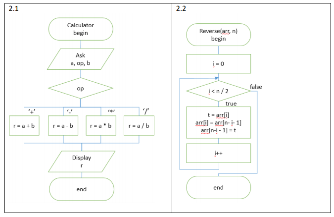

Практическая работа №1
======================

1. Разработайте программу по описанию. Дан массив вещественных чисел. Вычислите среднее значение и занулите элементы, которые меньше среднего

2. Реализуйте алгоритмы, нарисованные на блок-схемах в виде функций

3. Разработайте рекурсивный алгоритм рассчета суммы элементов целочисленного массива

4. Разработайте следующий алгоритм сортировки. Дан массив чисел от 0 до 9. Посчитайте кол-во повторений каждой из цифр и выведите отсортированный массив (упорядоченный от меньшего к большему) на основе этой информации
